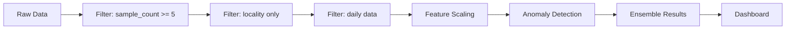

<div align="center">

# 📡 Network Performance Anomaly Detection

### AI-Powered Network Analysis Dashboard

[](https://www.python.org/)
[](https://pytorch.org/)
[](https://streamlit.io/)
[](LICENSE)

**Detect network anomalies using Isolation Forest, One-Class SVM, and PyTorch Autoencoder**

[🚀 Quick Start](#-quick-start) • [📊 Dashboard](#-dashboard-preview) • [📖 Documentation](#-documentation) • [❓ FAQ](#-faq)

</div>

---

## 📋 Table of Contents

- [🎯 Project Overview](#-project-overview)
- [✨ Key Features](#-key-features)
- [🛠️ Tech Stack](#️-tech-stack)
- [🚀 Quick Start](#-quick-start)
- [📊 Dashboard Preview](#-dashboard-preview)
- [📁 Project Structure](#-project-structure)
- [📖 Documentation](#-documentation)
  - [Data Pipeline](#data-pipeline)
  - [Anomaly Detection Methods](#Anomaly-detection-methods)
  - [Dashboard Features](#dashboard-features)
- [🔧 Configuration](#-configuration)
- [📈 Results](#-results)
- [❓ FAQ](#-faq)
- [🤝 Contributing](#-contributing)

---

## 🎯 Project Overview

This project implements a comprehensive **network performance Anomaly detection system** for telecom data analysis. It leverages three powerful machine learning techniques to identify unusual patterns in network KPIs:

<table>
<tr>
<td width="33%" align="center">

### 🌲 Isolation Forest
Tree-based ensemble method that isolates anomalies by randomly selecting features and split values

</td>
<td width="33%" align="center">

### 🎯 One-Class SVM
Support Vector Machine that learns a decision boundary around normal data points

</td>
<td width="33%" align="center">

### 🧠 PyTorch Autoencoder
Neural network that learns to reconstruct normal data; high reconstruction error indicates anomalies

</td>
</tr>
</table>

### 📈 KPIs Analyzed

| KPI | Description | Unit |
|-----|-------------|------|
| 📥 **Download Speed** | Average download throughput | kbps |
| 📤 **Upload Speed** | Average upload throughput | kbps |
| ⏱️ **Latency** | Network round-trip time | ms |

### 🌍 Data Dimensions

| Dimension | Values |
|-----------|--------|
| 🗺️ **Regions** | 13 Egyptian governorates |
| 📡 **Carriers** | 3 operators (Operator A, B, C) |
| 📶 **Technologies** | LTE, 5G |
| 📅 **Date Range** | 21 days of daily measurements |

---

## ✨ Key Features

<details>
<summary><b>🔬 Click to expand features</b></summary>

### Anomaly Detection
- ✅ Three complementary detection methods
- ✅ Ensemble approach for high-confidence anomalies
- ✅ Configurable contamination rates
- ✅ Real-time scoring

### Data Processing
- ✅ Automatic data filtering (sample count threshold)
- ✅ Missing value handling
- ✅ Feature scaling and normalization
- ✅ Date parsing and validation

### Visualization
- ✅ Interactive Streamlit dashboard
- ✅ 2D and 3D scatter plots
- ✅ Heatmaps and trend charts
- ✅ Violin plots and box plots
- ✅ Method agreement analysis

### Export
- ✅ CSV export for Anomaly logs
- ✅ Summary report generation
- ✅ Visualizations saved as PNG

</details>

---

## 🛠️ Tech Stack

<table>
<tr>
<th>Category</th>
<th>Technology</th>
<th>Version</th>
</tr>
<tr>
<td>🐍 Language</td>
<td>Python</td>
<td>3.8+</td>
</tr>
<tr>
<td>🔥 Deep Learning</td>
<td>PyTorch</td>
<td>1.12+</td>
</tr>
<tr>
<td>🤖 ML Library</td>
<td>scikit-learn</td>
<td>1.0+</td>
</tr>
<tr>
<td>📊 Dashboard</td>
<td>Streamlit</td>
<td>1.20+</td>
</tr>
<tr>
<td>📈 Visualization</td>
<td>Plotly, Matplotlib, Seaborn</td>
<td>Latest</td>
</tr>
<tr>
<td>📓 Notebook</td>
<td>Jupyter</td>
<td>1.0+</td>
</tr>
</table>

---

## 🚀 Quick Start

### Prerequisites

```bash
# Check Python version
python --version  # Should be 3.8 or higher

# Check pip
pip --version
```

### Installation


### option 1: Run Everything (Recommended)

**Linux/Mac - Complete Pipeline:**

```bash
cd Anomaly_detection_project
bash run_all.sh
```

### option 2: Launch dashboard only

```bash
 streamlit.exe run app.py 
```

---
### 🎉 Access the Dashboard

After running, open your browser and navigate to:
```
http://localhost:8501
```

---

## 📊 Dashboard Preview

<details>
<summary><b>📸 Click to view dashboard screenshots</b></summary>

### Overview Page
```
┌────────────────────────────────────────────────────────────────┐
│  📡 Network Performance Anomaly Detection                      │
├────────────────────────────────────────────────────────────────┤
│  ┌──────────┐ ┌──────────┐ ┌──────────┐ ┌──────────┐         │
│  │ Total    │ │ Regions  │ │ Carriers │ │ Anomalies│         │
│  │ 8,086    │ │    13    │ │    3     │ │   203    │         │
│  └──────────┘ └──────────┘ └──────────┘ └──────────┘         │
├────────────────────────────────────────────────────────────────┤
│  📈 Method Comparison          │  🎯 Method Agreement          │
│  ┌────────────────────┐       │  ┌────────────────────┐       │
│  │ ▓▓▓▓▓▓▓▓▓▓ 404     │       │  │    PIE CHART       │       │
│  │ ▓▓▓▓▓▓▓▓▓▓▓ 404     │       │  │    All 3: 12%      │       │
│  │ ▓▓▓▓▓▓▓▓▓▓▓ 404     │       │  │    Exactly 2: 23%  │       │
│  └────────────────────┘       │  └────────────────────┘       │
└────────────────────────────────────────────────────────────────┘
```

### Interactive Features
- 🎛️ Real-time filtering by Region, Carrier, Technology
- 📅 Date range selection
- 🔍 Search functionality in Anomaly log
- 📥 CSV and report export

</details>

---

## 📁 Project Structure

```
Anomaly_detection_project/
│
├── 📓 Network_Anomaly_Detection.ipynb    # Main Jupyter notebook
│   ├── Data loading & filtering
│   ├── Exploratory Data Analysis
│   ├── Isolation Forest training
│   ├── One-Class SVM training
│   ├── PyTorch Autoencoder training
│   └── Results export
│
├── 📊 app.py                              # Streamlit dashboard
│   ├── Overview page
│   ├── Anomaly Analysis (tabs)
│   ├── Performance Trends
│   ├── Project Questions
│   └── Anomaly Log
│
├── 📄 requirements.txt                    # Python dependencies
│
├── 🚀 run_all.sh                          # One-click run script
│
├── 📋 Performance.csv                     # Source dataset
│
└── 📂 outputs/                            # Generated by notebook
    ├── processed_data_with_anomalies.csv  # Main results
    ├── summary_stats.json                 # Key metrics
    ├── method_comparison.csv              # Method stats
    ├── q1_regional_variability.csv        # Q1 results
    ├── q2_daily_anomalies.csv             # Q2 results
    ├── q3_carrier_consistency.csv         # Q3 results
    ├── q4_lte_vs_5g.csv                   # Q4 results
    ├── q5_region_carrier_combinations.csv # Q5 results
    └── Anomaly_log.csv                    # High-confidence anomalies
```

---

## 📖 Documentation

### Data Pipeline



### Anomaly Detection Methods

<details>
<summary><b>🌲 Isolation Forest</b></summary>

```python
# Configuration
IsolationForest(
    n_estimators=100,    # Number of trees
    contamination=0.05,  # Expected Anomaly ratio
    random_state=42,     # Reproducibility
    n_jobs=-1           # Use all cores
)

# How it works
# 1. Build random trees by selecting features and split values
# 2. Anomalies are isolated in fewer steps (shorter path length)
# 3. Average path length determines Anomaly score
```

**Strengths:**
- Fast and efficient
- Handles high-dimensional data
- No need for scaling (but recommended)

**Weaknesses:**
- Random nature can affect consistency
- May miss clustered anomalies

</details>

<details>
<summary><b>🎯 One-Class SVM</b></summary>

```python
# Configuration
OneClassSVM(
    kernel='rbf',    # Radial basis function
    nu=0.05,         # Upper bound on Anomaly fraction
    gamma='scale'    # Kernel coefficient
)

# How it works
# 1. Learn a decision boundary around normal data
# 2. Map data to higher-dimensional space using kernel
# 3. Points outside boundary are anomalies
```

**Strengths:**
- Effective for non-linear boundaries
- Well-established theoretical foundation

**Weaknesses:**
- Computationally expensive (O(n²) or O(n³))
- Requires careful parameter tuning

</details>

<details>
<summary><b>🧠 PyTorch Autoencoder</b></summary>

```python
# Architecture
Autoencoder(
    (encoder): Sequential(
        Linear(3, 16) -> ReLU
        Linear(16, 8) -> ReLU
        Linear(8, 2) -> ReLU    # Bottleneck
    )
    (decoder): Sequential(
        Linear(2, 8) -> ReLU
        Linear(8, 16) -> ReLU
        Linear(16, 3) -> Sigmoid
    )
)

# Training
optimizer = Adam(lr=0.001)
criterion = MSELoss()
epochs = 50
batch_size = 256

# How it works
# 1. Train to reconstruct normal data
# 2. Anomalies have high reconstruction error
# 3. MSE > 95th percentile = Anomaly
```

**Strengths:**
- Learns complex patterns
- Can capture non-linear relationships
- Good for high-dimensional data

**Weaknesses:**
- Requires more training time
- Needs careful architecture design

</details>

### Dashboard Features

| Page | Features |
|------|----------|
| **📊 Overview** | Key metrics, method comparison, 3D scatter plot |
| **🔍 Analysis** | By Region (with heatmap), By Carrier, By Technology, By Method |
| **📈 Trends** | Interactive metric selection, daily breakdown, violin plots |
| **❓ Questions** | Q1-Q5 with interactive charts |
| **📋 Log** | Searchable table, sorting, CSV/report export |

---

## 🔧 Configuration

### Adjusting Detection Sensitivity

```python
# In the notebook, modify these parameters:

# Isolation Forest - contamination rate
IsolationForest(contamination=0.05)  # Lower = fewer anomalies

# One-Class SVM - nu parameter
OneClassSVM(nu=0.05)  # Lower = fewer anomalies

# Autoencoder - percentile threshold
threshold = np.percentile(mse, 95)  # Higher = fewer anomalies
```

### High-Confidence Anomaly Threshold

```python
# Current: At least 2 methods agree
df['high_confidence_Anomaly'] = (df['methods_agree'] >= 2).astype(int)

# Change to: All 3 methods must agree (more strict)
df['high_confidence_Anomaly'] = (df['methods_agree'] == 3).astype(int)

# Change to: At least 1 method (less strict)
df['high_confidence_Anomaly'] = (df['methods_agree'] >= 1).astype(int)
```

---

## 📈 Results

### Detection Summary

| Method | Anomalies | Rate |
|--------|-----------|------|
| 🌲 Isolation Forest | ~404 | 5.00% |
| 🎯 One-Class SVM | ~404 | 5.00% |
| 🧠 Autoencoder | ~404 | 5.00% |
| **High-Confidence (≥2)** | **~203** | **~2.5%** |

### Key Findings

<details>
<summary><b>📊 Click to view detailed findings</b></summary>

#### Q1: Most Variable Regions (Download Speed)
Regions with highest coefficient of variation indicate unstable network conditions.

#### Q2: Days with Abnormal Behavior
Specific dates showing widespread anomalies across multiple regions.

#### Q3: Carrier Consistency
Carrier with lowest CV% and Anomaly rate is most consistent.

#### Q4: LTE vs 5G Comparison
- **5G**: Higher speeds, lower latency, potentially lower Anomaly rate
- **LTE**: More established infrastructure, different Anomaly patterns

#### Q5: Worst Region-Carrier Combinations
Top problematic combinations requiring attention.

</details>

---

## ❓ FAQ

<details>
<summary><b>Q: How long does the notebook take to run?</b></summary>

**A:** Approximately 2-5 minutes depending on your hardware:
- Data loading: ~10 seconds
- Isolation Forest: ~5 seconds
- One-Class SVM: ~30 seconds
- Autoencoder training: ~1-2 minutes (50 epochs)

</details>

<details>
<summary><b>Q: Can I use my own data?</b></summary>

**A:** Yes! Replace `Performance.csv` with your data file containing:
- Required columns: `mean_download_kbps`, `mean_upload_kbps`, `mean_latency_ms`
- Optional columns: `region`, `carrier_name`, `technology_type`, `aggregate_date`

</details>

<details>
<summary><b>Q: How do I adjust the Anomaly detection threshold?</b></summary>

**A:** Modify the contamination rate in the notebook:
```python
# For stricter detection (fewer anomalies)
IsolationForest(contamination=0.03)  # 3% instead of 5%

# For more sensitive detection (more anomalies)
IsolationForest(contamination=0.10)  # 10% instead of 5%
```

</details>

<details>
<summary><b>Q: The dashboard shows "No output files found". What should I do?</b></summary>

**A:** Run the Jupyter notebook first:
```bash
jupyter nbconvert --execute Network_Anomaly_Detection.ipynb --to notebook
```

</details>

<details>
<summary><b>Q: Can I run this on GPU?</b></summary>

**A:** Yes! PyTorch will automatically use CUDA if available:
```python
device = torch.device('cuda' if torch.cuda.is_available() else 'cpu')
```

</details>

---

## 🤝 Contributing

Contributions are welcome! Please feel free to submit a Pull Request.

### Development Setup

```bash
# Clone the repository
git clone <repo>
cd <Foder of repo>

# Install development dependencies
pip install -r requirements.txt

# Run tests
python -m pytest tests/  # (if tests exist)
```

---

## 📜 License

ITI - Internal Training Material
---


### 🌟 If you find this project useful, please give it a star! 🌟

**Built with ❤️ for Network Analysis**

[⬆️ Back to Top](#-network-performance-Anomaly-detection)

</div>
